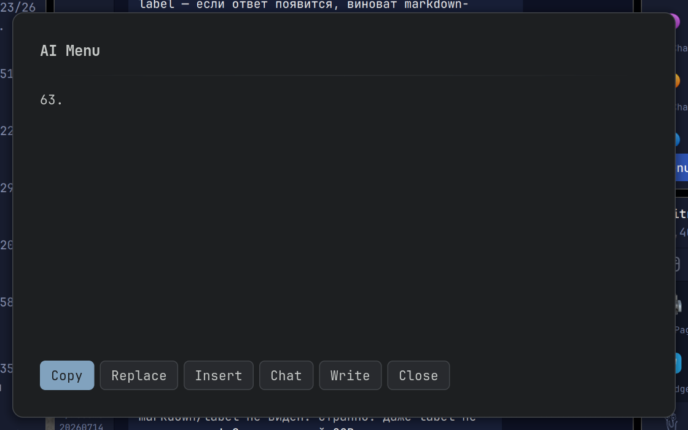

# AI Menu — плагин Noctalia v5

Оверлей-панель с AI-командами: выдели текст → Ctrl+Alt+Space → выбери команду → результат вставляется обратно. Работает с любым Hermes-совместимым API (OpenAI-формат).



## Возможности

- **Стриминг ответа**: токены появляются по мере генерации (первый токен ~2-4с), а не после полного ответа (16-25с)
- **Tool-calls**: когда модель вызывает калькулятор/терминал (например «сколько будет 8*9»), панель показывает «🐍 python3 -c …» — статус выполняемого инструмента, а финальный ответ приходит в потоке
- **Постоянная сессия**: все запросы идут в одну сессию `ai-menu` (контекст сохраняется между запросами)
- **Очистка сессии**: тумблер «очищать сессию перед каждым запросом» (DELETE /api/sessions/ai-menu — новые сессии не плодятся)
- **Локализация**: en/ru (интерфейс панели переключается настройкой `language`; настройки в GUI Noctalia — системным языком Noctalia)
- **21 команда** из `~/.config/ai-menu/commands.json`, «Ask me anything» — свободный вопрос
- **Клавиатура и мышь**: ↑/↓ выбор, Enter запуск, Esc закрыть, колесо — скролл

## Установка

1. Скопируй плагин в каталог источников Noctalia:
   ```bash
   noctalia msg plugins source add local-dev path /path/to/noctalia-plugins
   noctalia msg plugins enable tranzem/ai-menu
   ```
2. Горячая клавиша (пример для Umbriel, `~/.config/umbriel/config.toml`):
   ```toml
   "Ctrl+Alt+Space" = "spawn:noctalia msg panel-toggle tranzem/ai-menu:panel"
   ```

Пример конфига команд — `commands.example.json` в репозитории (скопируй в `~/.config/ai-menu/commands.json` и отредактируй под себя).

## Настройки (в GUI Noctalia: Plugins → AI Menu)

| Настройка | Default | Описание |
|---|---|---|
| `base_url` | `http://127.0.0.1:8642` | Адрес Hermes API |
| `model` | `deepseek-v4-flash` | Модель |
| `env_file` | `~/.hermes/.env` | Файл с `API_SERVER_KEY` |
| `commands_file` | `~/.config/ai-menu/commands.json` | Файл команд |
| `clear_session` | off | Очищать сессию перед каждым запросом |
| `chat_command` | `hermes chat --resume {session}` | Команда кнопки Chat |
| `language` | `en` | Язык интерфейса (en/ru) |

## Docker (Hermes в контейнере)

Плагин работает с Hermes в Docker, нужны две настройки:

1. **`env_file`** → путь к compose `.env` на хосте (там лежит `API_SERVER_KEY`):
   ```
   ~/hermes-workspace/.env
   ```
   Без ключа сессии не работают (401/403) — плагин покажет понятную ошибку.

2. **`chat_command`** → команда запуска чата через контейнер:
   ```
   docker exec -it hermes-agent hermes chat --resume {session}
   ```

Проверь, что порт 8642 проброшен в docker-compose (`ports: 8642:8642`) и `API_SERVER_KEY` задан в `.env`.

## Команды

Файл `commands.json` (21 команда). Формат:

```json
[
  {
    "name": "Explain this",
    "prompt": "Explain the text in triple quotes below:\n\"\"\"\n{input}\n\"\"\"",
    "name_ru": "Объясни это",
    "prompt_ru": "Объясни текст в тройных кавычках ниже:\n\"\"\"\n{input}\n\"\"\"",
    "ask": false
  }
]
```

- `{input}` — выделенный текст (или введённый вопрос для `ask`-команд)
- `name_ru`/`prompt_ru` — русские варианты (используются при `language=ru`)
- `ask: true` — команда «свободный вопрос»: по Enter открывается поле ввода

## Сессии Hermes

- Плагин всегда использует одну сессию `ai-menu` (заголовок `X-Hermes-Session-Id`).
- `clear_session=on`: история сессии удаляется перед каждым запросом через `DELETE /api/sessions/ai-menu` — новые сессии не плодятся.
- Кнопка **Chat** открывает терминал с `hermes chat --resume ai-menu` — продолжение той же сессии.

## Локализация

- **Интерфейс панели** (команды, кнопки, подсказки, ошибки): переключается настройкой `language` (`en` по умолчанию).
- **Настройки плагина в GUI Noctalia** (label_key в plugin.toml): локализуются **языком самого Noctalia** (`lang` в `~/.config/noctalia/config.toml`) через `translations/<lang>.json`. Чтобы настройки были на английском — поставь `lang = "en"` в конфиге Noctalia.
- Команды поддерживают `name_ru`/`prompt_ru` — при `language=ru` используются русские промпты.

## Архитектура

```
shortcut.luau ──toggle──▶ panel.luau ──HTTP stream──▶ Hermes API
                             │  ▲
                             │  │ state-канал "paste"
                             ▼  │
                          service.luau (отложенная вставка wtype)
```

- **panel.luau**: UI, фазы (list/ask/working/done), `noctalia.httpStream` (SSE), сбор `delta.content`, tool.progress
- **service.luau**: после закрытия панели эмулирует Ctrl+V через `wtype`, для Insert восстанавливает прежний буфер
- **shortcut.luau**: control-center tile, открывает панель

### Стриминг (как это работает)

1. Запрос уходит с `stream: true` через `noctalia.httpStream`
2. SSE-строки: `data: {delta.content}` накапливаются в `response` и отображаются сразу
3. `event: hermes.tool.progress` + `data: {tool, emoji, label}` — статус инструмента («🐍 python3 …»)
4. `data: [DONE]` → финальная обработка → фаза DONE с кнопками
5. Закрытие панели во время ответа → `handle.stop()` отменяет стрим

## Требования

- Wayland + Noctalia v5 (plugin_api 24)
- `wl-paste` / `wl-copy` (wl-clipboard), `wtype`
- Hermes API на `base_url` (порт 8642)
